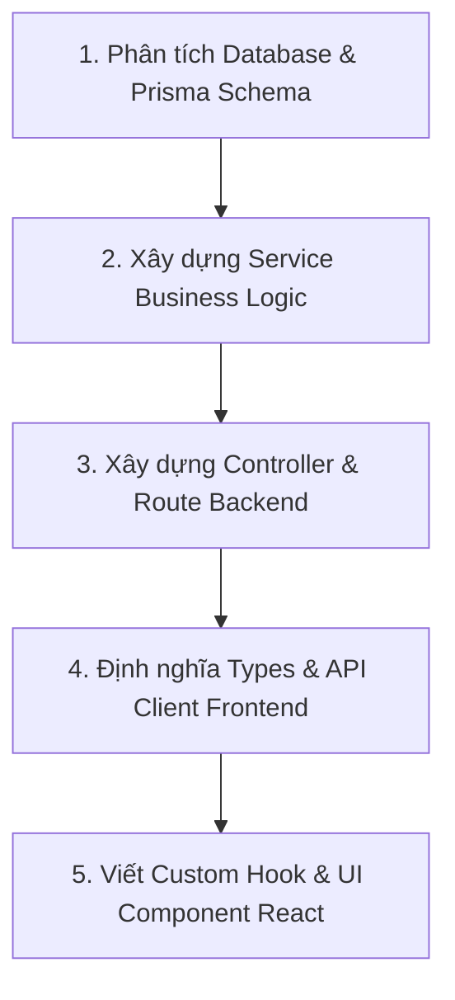

# QUY CHUẨN VÀ HƯỚNG DẪN AI PHÁT TRIỂN DỰ ÁN (AI CODING GUIDELINES)
> **Dự án**: Quản Lý Tài Chính Cá Nhân (`quan_ly_tien`)  
> **Tech Stack**:
> - **Backend**: Node.js + Express (v5) + TypeScript + Prisma ORM + MySQL
> - **Frontend**: React 19 + TypeScript + Vite + Axios + Lucide React + CSS
> **Mục tiêu**: Hướng dẫn AI Agent luôn tuân thủ kiến trúc phân tầng chuyên nghiệp (Clean/Layered Architecture), viết code sạch, an toàn, dễ bảo trì và có khả năng mở rộng.

---

## 1. NGUYÊN TẮC CỐT LÕI (CORE PRINCIPLES - BẮT BUỘC TUÂN THỦ)

1. **Tuyệt đối KHÔNG tạo "God File"**:
   - Nghiêm cấm việc nhồi nhét toàn bộ logic vào một file duy nhất (như `index.ts` của backend hoặc `App.tsx` của frontend).
   - Mỗi file chỉ đảm nhiệm một trách nhiệm duy nhất (Single Responsibility Principle - SRP).
2. **Tuân thủ phân tầng nghiêm ngặt (Separation of Concerns)**:
   - **Backend**: `Route` ➔ `Middleware` ➔ `Controller` ➔ `Service` ➔ `Prisma (Database)`.
     - Controller **không bao giờ** gọi trực tiếp Prisma hoặc viết query DB.
     - Service **không bao giờ** thao tác trực tiếp với các đối tượng HTTP như `req`, `res`.
   - **Frontend**: `Page / Feature` ➔ `Custom Hook` ➔ `API Service` ➔ `Axios Client`.
     - UI Component **không bao giờ** gọi `axios.get/post` trực tiếp trong component hoặc `useEffect`.
3. **TypeScript Chặt Chẽ (Strict Typing)**:
   - Không được sử dụng kiểu `any` bừa bãi.
   - Luôn định nghĩa rõ ràng: Interface/Type cho Request DTO, Response DTO, Database Model và Component Props.
4. **Chuẩn hóa phản hồi API (Unified API Response Format)**:
   - Mọi API trả về JSON phải theo định dạng chuẩn:
     ```json
     {
       "success": true,
       "message": "Thông báo thân thiện",
       "data": { ... }
     }
     ```
   - Khi có lỗi:
     ```json
     {
       "success": false,
       "message": "Mô tả lỗi cụ thể",
       "error": "Chi tiết lỗi (chỉ hiện trong dev mode)"
     }
     ```
5. **Xử lý lỗi tập trung (Centralized Error Handling)**:
   - Backend sử dụng custom class `AppError` và Error Middleware tập trung.
   - Frontend hiển thị thông báo lỗi rõ ràng qua Toast/Modal, có fallback UI khi tải dữ liệu thất bại.
6. **Bảo mật & Biến môi trường**:
   - Không bao giờ hardcode URL, mật khẩu, database URI hoặc secret keys.
   - Mọi cấu hình nhạy cảm phải đọc từ `.env` (backend: `process.env.*`, frontend: `import.meta.env.VITE_*`).

---

## 2. CẤU TRÚC BACKEND CHUẨN (NODE.JS + EXPRESS + PRISMA + TYPESCRIPT)

### 2.1. Cây thư mục Backend
```
backend/
├── prisma/
│   ├── schema.prisma              # Định nghĩa schema CSDL (Users, Wallets, Categories, Transactions)
│   └── migrations/                # Lịch sử migration Prisma
├── src/
│   ├── config/                    # Cấu hình hệ thống & kết nối DB
│   │   ├── db.ts                  # Singleton instance của PrismaClient
│   │   └── env.ts                 # Kiểm tra và nạp biến môi trường (.env)
│   │
│   ├── controllers/               # Tiếp nhận Request, gọi Service, trả Response HTTP
│   │   ├── auth.controller.ts
│   │   ├── wallet.controller.ts
│   │   ├── category.controller.ts
│   │   └── transaction.controller.ts
│   │
│   ├── services/                  # Business Logic, tính toán, thao tác Prisma CSDL
│   │   ├── auth.service.ts
│   │   ├── wallet.service.ts
│   │   ├── category.service.ts
│   │   └── transaction.service.ts
│   │
│   ├── routes/                    # Định nghĩa URL Endpoints và gán Middleware
│   │   ├── index.ts               # Gom tất cả routes gắn vào tiền tố /api
│   │   ├── auth.routes.ts
│   │   ├── wallet.routes.ts
│   │   ├── category.routes.ts
│   │   └── transaction.routes.ts
│   │
│   ├── middlewares/               # Middlewares can thiệp request pipeline
│   │   ├── auth.middleware.ts     # Xác thực JWT token
│   │   ├── error.middleware.ts    # Bắt lỗi toàn cục (Global Error Handler)
│   │   └── validate.middleware.ts # Kiểm tra tính hợp lệ của Request Body / Query
│   │
│   ├── dtos/                      # Data Transfer Objects & Validation Types
│   │   ├── auth.dto.ts
│   │   ├── wallet.dto.ts
│   │   └── transaction.dto.ts
│   │
│   ├── types/                     # Kiểu dữ liệu TypeScript dùng chung
│   │   ├── express.d.ts           # Mở rộng Request để chứa req.user
│   │   └── common.types.ts
│   │
│   ├── utils/                     # Hàm tiện ích
│   │   ├── apiResponse.ts         # Chuẩn hoá response thành công & thất bại
│   │   ├── AppError.ts            # Custom class lỗi kèm HTTP status code
│   │   └── asyncHandler.ts        # Bọc hàm async để tự bắt lỗi vào next(err)
│   │
│   ├── app.ts                     # Cấu hình Express App (middlewares, cors, routes)
│   └── index.ts                   # Entry point: lắng nghe PORT và khởi động server
│
├── .env                           # Biến môi trường
├── package.json
└── tsconfig.json
```

### 2.2. Quy chuẩn code từng tầng Backend

#### 1. Tầng Config (`src/config/db.ts`):
Khởi tạo duy nhất một thể hiện của `PrismaClient` để tránh cạn kiệt connection pool:
```typescript
import { PrismaClient } from '@prisma/client';

const prisma = new PrismaClient({
  log: process.env.NODE_ENV === 'development' ? ['query', 'error', 'warn'] : ['error'],
});

export default prisma;
```

#### 2. Tầng Controller (`src/controllers/`):
- Chỉ làm nhiệm vụ: Lấy `req.body`, `req.params`, `req.query`, gọi `service`, và trả kết quả qua helper `apiResponse`.
- Không chứa logic tính toán tiền bạc, không query `prisma`.
```typescript
import { Request, Response, NextFunction } from 'express';
import * as transactionService from '../services/transaction.service';
import { sendSuccess } from '../utils/apiResponse';

export const createTransaction = async (req: Request, res: Response, next: NextFunction) => {
  try {
    const userId = req.user?.id || 1; // Hoặc từ auth middleware
    const result = await transactionService.createTransaction(userId, req.body);
    return sendSuccess(res, result, 'Tạo giao dịch thành công', 201);
  } catch (error) {
    next(error);
  }
};
```

#### 3. Tầng Service (`src/services/`):
- Chứa toàn bộ logic nghiệp vụ (ví dụ: khi thêm giao dịch chi tiêu thì trừ tiền trong ví tương ứng).
- Sử dụng `prisma.$transaction` khi có nhiều thao tác CSDL liên quan nhau để đảm bảo tính toàn vẹn.
- Ném lỗi bằng `AppError(statusCode, message)`.
```typescript
import prisma from '../config/db';
import { AppError } from '../utils/AppError';
import { CreateTransactionDTO } from '../dtos/transaction.dto';

export const createTransaction = async (userId: number, data: CreateTransactionDTO) => {
  const { amount, note, walletId, categoryId } = data;

  const wallet = await prisma.wallets.findFirst({
    where: { id: walletId, userId },
  });
  if (!wallet) throw new AppError(404, 'Không tìm thấy ví tiền');

  const category = await prisma.categories.findFirst({
    where: { id: categoryId, userId },
  });
  if (!category) throw new AppError(404, 'Không tìm thấy danh mục');

  // Thực hiện transaction: Lưu giao dịch và cập nhật số dư ví
  return await prisma.$transaction(async (tx) => {
    const transaction = await tx.transactions.create({
      data: {
        amount,
        note,
        userId,
        walletId,
        categoryId,
      },
    });

    const balanceChange = category.type === 'EXPENSE' ? -Number(amount) : Number(amount);

    await tx.wallets.update({
      where: { id: walletId },
      data: {
        balance: { increment: balanceChange },
      },
    });

    return transaction;
  });
};
```

#### 4. Tầng Error Handler (`src/middlewares/error.middleware.ts`):
```typescript
import { Request, Response, NextFunction } from 'express';
import { AppError } from '../utils/AppError';

export const errorHandler = (
  err: any,
  req: Request,
  res: Response,
  next: NextFunction
) => {
  const statusCode = err.statusCode || 500;
  const message = err.message || 'Lỗi hệ thống nội bộ';

  console.error(`[ERROR] ${req.method} ${req.path} >> StatusCode: ${statusCode}, Message: ${message}`);
  if (statusCode === 500) console.error(err.stack);

  res.status(statusCode).json({
    success: false,
    message,
    ...(process.env.NODE_ENV === 'development' && { stack: err.stack }),
  });
};
```

---

## 3. CẤU TRÚC FRONTEND CHUẨN (REACT 19 + VITE + TYPESCRIPT)

### 3.1. Cây thư mục Frontend
```
frontend/
├── src/
│   ├── api/                       # Gọi API Backend qua Axios
│   │   ├── axiosClient.ts         # Axios instance: gán BaseURL, Interceptors bắt token & lỗi
│   │   ├── authApi.ts
│   │   ├── walletApi.ts
│   │   ├── categoryApi.ts
│   │   └── transactionApi.ts
│   │
│   ├── assets/                    # Icons, hình ảnh tĩnh, logo
│   │
│   ├── components/                # UI Components tái sử dụng (Dumb/Presentational)
│   │   ├── common/                # Thành phần UI cơ bản (Button, Input, Modal, Badge, Spinner)
│   │   │   ├── Button.tsx
│   │   │   ├── Modal.tsx
│   │   │   └── LoadingSpinner.tsx
│   │   └── layout/                # Khung giao diện (Header, Sidebar, Navbar, PageContainer)
│   │       ├── Header.tsx
│   │       ├── Sidebar.tsx
│   │       └── MainLayout.tsx
│   │
│   ├── features/                  # Các module nghiệp vụ theo từng màn hình/tính năng
│   │   ├── dashboard/             # Màn hình thống kê / tổng quan
│   │   │   ├── components/        # BalanceSummary, QuickActions, RecentActivity
│   │   │   └── DashboardPage.tsx
│   │   ├── transactions/          # Quản lý thu chi
│   │   │   ├── components/        # TransactionFormModal, TransactionItem, TransactionList
│   │   │   ├── hooks/             # useTransactions.ts
│   │   │   └── TransactionPage.tsx
│   │   └── wallets/               # Quản lý ví tiền
│   │       ├── components/        # WalletCard, WalletFormModal
│   │       └── WalletPage.tsx
│   │
│   ├── contexts/                  # Quản lý Global State bằng React Context (hoặc Zustand)
│   │   ├── AuthContext.tsx        # Trạng thái đăng nhập người dùng
│   │   └── WalletContext.tsx      # Ví đang được chọn hiện tại
│   │
│   ├── hooks/                     # Custom Hooks dùng chung
│   │   ├── useDebounce.ts
│   │   └── useModal.ts
│   │
│   ├── types/                     # Kiểu dữ liệu TypeScript dùng chung trên Frontend
│   │   ├── api.types.ts           # ApiResponse<T>
│   │   ├── transaction.types.ts
│   │   ├── wallet.types.ts
│   │   └── category.types.ts
│   │
│   ├── utils/                     # Hàm tiện ích format hiển thị
│   │   ├── formatCurrency.ts      # Định dạng tiền tệ VND (vd: 150.000 ₫)
│   │   ├── formatDate.ts          # Định dạng ngày giờ thân thiện (vd: 05/10/2026)
│   │   └── constants.ts           # Hằng số, URL, options
│   │
│   ├── styles/                    # Stylesheet toàn cục, CSS Tokens, variables
│   │   ├── index.css
│   │   └── App.css
│   │
│   ├── App.tsx                    # Component gốc điều hướng Layout & Routing
│   └── main.tsx                   # Entry point React DOM
│
├── .env                           # VITE_API_URL=http://localhost:5000/api
├── package.json
└── vite.config.ts
```

### 3.2. Quy chuẩn code từng tầng Frontend

#### 1. Cấu hình Axios Client (`src/api/axiosClient.ts`):
```typescript
import axios from 'axios';

const axiosClient = axios.create({
  baseURL: import.meta.env.VITE_API_URL || 'http://localhost:5000/api',
  headers: {
    'Content-Type': 'application/json',
  },
  timeout: 10000,
});

// Request Interceptor: Đính kèm Bearer Token nếu có
axiosClient.interceptors.request.use((config) => {
  const token = localStorage.getItem('token');
  if (token && config.headers) {
    config.headers.Authorization = `Bearer ${token}`;
  }
  return config;
});

// Response Interceptor: Trả về data trực tiếp và xử lý lỗi tập trung
axiosClient.interceptors.response.use(
  (response) => response.data,
  (error) => {
    const message = error.response?.data?.message || 'Có lỗi xảy ra khi kết nối máy chủ';
    console.error('[API Error]:', message);
    return Promise.reject(error.response?.data || { message });
  }
);

export default axiosClient;
```

#### 2. Tầng API Module (`src/api/transactionApi.ts`):
```typescript
import axiosClient from './axiosClient';
import { ApiResponse } from '../types/api.types';
import { Transaction, CreateTransactionDTO } from '../types/transaction.types';

export const transactionApi = {
  getAll: (): Promise<ApiResponse<Transaction[]>> => {
    return axiosClient.get('/transactions');
  },
  create: (data: CreateTransactionDTO): Promise<ApiResponse<Transaction>> => {
    return axiosClient.post('/transactions', data);
  },
  delete: (id: number): Promise<ApiResponse<null>> => {
    return axiosClient.delete(`/transactions/${id}`);
  },
};
```

#### 3. Tầng Custom Hook (`src/features/transactions/hooks/useTransactions.ts`):
Tách toàn bộ logic quản lý trạng thái, nạp dữ liệu ra khỏi UI:
```typescript
import { useState, useEffect, useCallback } from 'react';
import { transactionApi } from '../../../api/transactionApi';
import { Transaction, CreateTransactionDTO } from '../../../types/transaction.types';

export const useTransactions = () => {
  const [transactions, setTransactions] = useState<Transaction[]>([]);
  const [loading, setLoading] = useState(false);
  const [error, setError] = useState<string | null>(null);

  const fetchTransactions = useCallback(async () => {
    try {
      setLoading(true);
      setError(null);
      const res = await transactionApi.getAll();
      if (res.success && res.data) {
        setTransactions(res.data);
      }
    } catch (err: any) {
      setError(err.message || 'Lỗi khi tải giao dịch');
    } finally {
      setLoading(false);
    }
  }, []);

  useEffect(() => {
    fetchTransactions();
  }, [fetchTransactions]);

  const addTransaction = async (dto: CreateTransactionDTO) => {
    const res = await transactionApi.create(dto);
    if (res.success) {
      await fetchTransactions(); // Refresh danh sách
    }
    return res;
  };

  return { transactions, loading, error, refetch: fetchTransactions, addTransaction };
};
```

#### 4. Tầng UI Component (Sạch sẽ, chỉ nhận Props hoặc gọi Hook):
- `TransactionPage.tsx` chỉ kết hợp UI, không chứa code fetch API thô sơ.
- Dùng `formatCurrency` helper thay vì viết logic hiển thị tiền trực tiếp trong JSX.

---

## 4. QUY TRÌNH KHI AI ĐƯỢC YÊU CẦU PHÁT TRIỂN TÍNH NĂNG MỚI

Khi nhận được một tính năng mới (ví dụ: *"Thêm tính năng báo cáo theo danh mục"* hoặc *"Chức năng chỉnh sửa ví tiền"*), AI phải tuân thủ trình tự 5 bước:



1. **Bước 1 - Database**: Kiểm tra `schema.prisma`. Nếu cần thêm bảng hoặc cột, tạo migration hoặc cập nhật schema trước.
2. **Bước 2 - Service**: Viết hàm xử lý logic trong `src/services/` của backend, tính toán và thao tác Prisma có validation.
3. **Bước 3 - Controller & Route**: Viết controller đón request, tạo route gán middleware phù hợp và kiểm tra endpoint.
4. **Bước 4 - Frontend API & Types**: Khai báo interface trong `frontend/src/types/`, tạo hàm gọi API trong `frontend/src/api/`.
5. **Bước 5 - UI & Hook**: Tạo custom hook nếu cần xử lý state phức tạp, chia nhỏ UI thành các component con và ráp vào trang chính.

---

## 5. NHỮNG ĐIỀU CẤM KỴ (ANTI-PATTERNS - AI KHÔNG ĐƯỢC PHÉP LÀM)

❌ **KHÔNG** viết toàn bộ code vào `backend/src/index.ts` hay `frontend/src/App.tsx`.  
❌ **KHÔNG** gọi `prisma` trực tiếp trong Controller hoặc Route.  
❌ **KHÔNG** gọi `axios` trực tiếp trong component UI (luôn thông qua `api/` hoặc custom hook).  
❌ **KHÔNG** để kiểu dữ liệu `any` mà không có lý do bất khả kháng.  
❌ **KHÔNG** hardcode chuỗi URL `http://localhost:5000` trong code React.  
❌ **KHÔNG** bỏ qua bước xử lý lỗi (luôn có try/catch ở Service/Controller và hiển thị lỗi ở UI).  
❌ **KHÔNG** tính toán tiền tệ bằng phép trừ/cộng không an toàn ở tầng Client; mọi biến động số dư phải do Backend tính toán bằng Database Transaction.  
